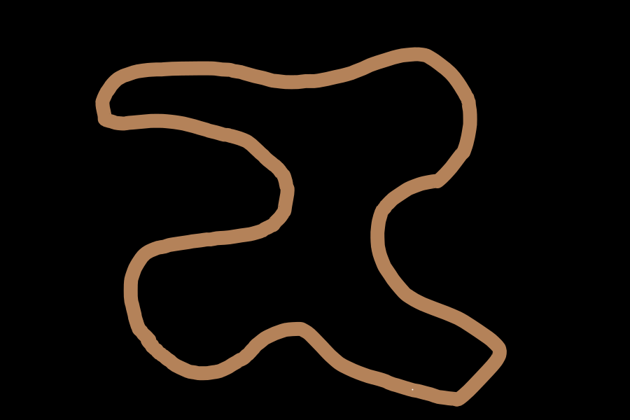
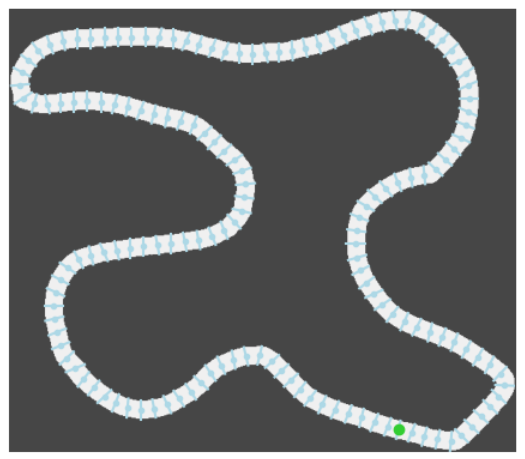

# PE-trajectory-optimization

# Abstract

The project is divided into five parts:
 - Creating a racing car environment to simulate a simple 2D racing car model.
 - Implementing Deep Q-Learning and Genetic Algorithms to optimize the behavior of a car on every possible tracks, enabling it to follow the best possible trajectories.
 - Evaluating the performance of Deep Q-Learning and Genetic Algorithms and comparing their results.
 - Assessing the performance of Deep Q-Learning with respect to different hyper-parameters.
 - Evaluating the performance of the best car behavior achieved by both algorithms.

# Introduction

We focus on solving the problem of optimizing a car's trajectory using a Deep Q-Learning model. The goal is to assess the ability of this model to generalize its experience from a limited number of circuits to new ones. To achieve this, we consider the car's trajectory in a plane under a simplified physics model. The model's performance will be compared to that of a genetic algorithm. Then, we will examine the impact of the chosen hyper-parameters on the model's training performance. Finally, we will explore the model's limitations when trained on a large amount of data.

# Modeling
## Racing environment
### Tracks

A track is originally a .png file which look like the left image of next figure. Then, the image is converted to a matrix $T$ such that $T[0][0]$ is the bottom left corner. After that, we crop the image, compute the starting point and the lines of track (that will be explained in the reward part) to have a final result which look the right image of next figure. The white case represent the road, the green point represent the starting point.

	

### Cars' physics
The Car physic is really simple. It is a 2D cartoon-like physics that act as follow:

The car has two main informations: its speed $\in [0,$ MaxSpeed$]$ and its rotation $\in [0,360]$.

The physics acts as follow: at each times step the car move to next coordinates on the direction of the car's rotation and of distance equal to the car's speed.

If the current coordinate of the car is $(x,y)$, its speed is $s$ and its rotation is $\alpha$, then, after a time step, the coordinate of the car will be:
$$(s.cos(\frac{\pi}{180}\alpha) + x,\; s.sin(\frac{\pi}{180}\alpha) + y)$$

Moreover, at each time step, the car can make some actions:
 - It can accelerate, this will increase the car's speed by a constant.
 - It can brake, this will decrease the car's speed by a constant. Note tah the car cannot have a negative speed, it means that it cannot go backward.
 -  It can turn, i.e. add a constant $\in \llbracket-K,K\rrbracket$ to its rotation. $K$ is a constant that is the maximum angle the car can turn per each time step.

The behavior of the car will need to interact with the track therefore we need to decide what is the state of a car, i.e. how the car see the environment. We could give to our algorithms the matrix of the track and the informations of the car but this will lead to to many parameters because a track can have size $900\times600$ pixels (or more). Therefore we will need to train on all possible state which will be at least $2^{900\times 600}$. Therefore, we decided to give a more realistic state which represent how a car racer see a track we he discover it. Then the state of a car is a array $V$ of size $8$.
 - $V_0$ is the current speed of the car
 - $\forall i\in\{1,...,7\}$, $V_i$ is the distance of the car to the next wall in the direction $\alpha + A_{i-1}$ where $\alpha$ is the current rotation of the car and $A=[60, 40, 20, 0, -20, -40, -60]$

Then, the representation looks like the following figure:

		
### Technical aspects of the environment

To manipulate our environment, we use the python packages \texttt{gymnasium} which provide code convention for those type or environment, i.e. environment where at each time step, you have one action to do. The environment has to have some essential function: \texttt{reset()} that reset the environment to be able to do an other simulation, \texttt{render()} that render the current state of our environment and the most important one is \texttt{step()} that do one step of time, i.e. given an action, the \texttt{step()} function figure out is the car has crashed or not, move the car to its next position and return the new state of the car, a reward and if the car has crashed.

Our environment has a variable named \texttt{time} which give us the opportunities to discreet more or less the time.
		
### Rewards

For those type of problem where the AI model has to compute a behavior, the AI model produces something which look like a function $f$ that take a car state and return an action. We need to specifies to our AI model when it produce a good action and a bad action, for instance, if a car crash, we need to punish the AI model.

We do that thanks to a reward function implemented in the function \texttt{step()} of our environment. The reward is an integer, the bigger it is the best the action was. This function is clearly the most important one of all the project because it is thanks to it that our AI model will perform well or not. We tried lot of reward functions, some that we invent, other that we see on other projects and we finish by using the following one:

To punished the car when it do something bad we do:
 - If the car crashes, we stop the simulation and return a reward of $-500$.
 - If the car is not moving, i.e. has a speed of $0$, the reward is $-10$.

For the positive reward, we have automatically computed some track line thanks to an algorithms we ceated (represented in right image of first figure). If the car crosses next line, it has a reward of $(+10\times$ the number of lines it has cross in the good order with this action). If the car cross a line in the wrong order, it means that it has gone backward, therefore, we punished the car with a reward of $-200$ and we stop the computation.

On top of that, at each time step, we add to the current reward the speed of the car divided by a constant to encourage the car to go fast. Finally, we subtrack the reward by $1$ to encourage the car to cross has many lines has possible with the least amout of time steps.

### An example of a car on a track

After explaining all of this, here is an example iin next figure. We have plot the trajectory of the car, the green color is when the car has accelerate, red color when it has brake and yellow otherwise.

The total reward of a car behavior is the sum of all reward of a simulation with a car behavior. For example, the reward of the car behavior or the figure is $\underset{r \in R}{\sum} r= -343$.

