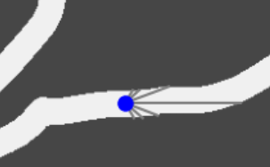
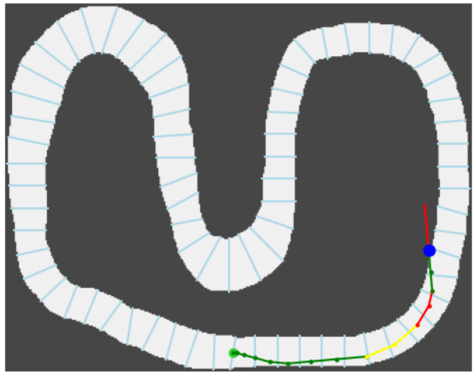
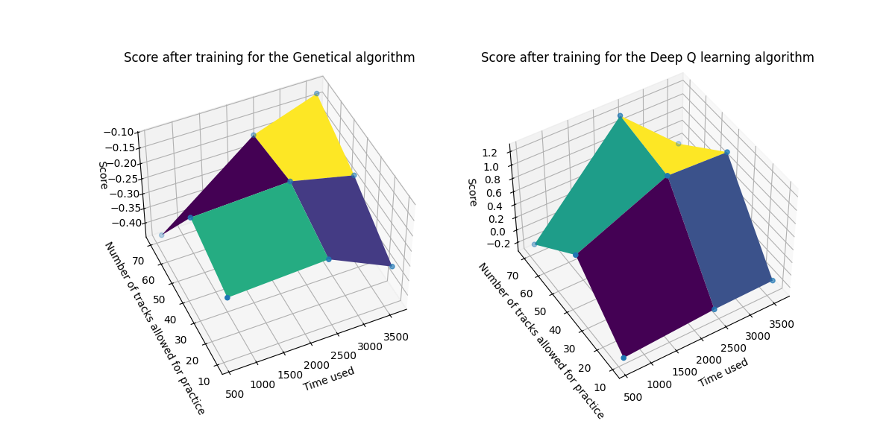
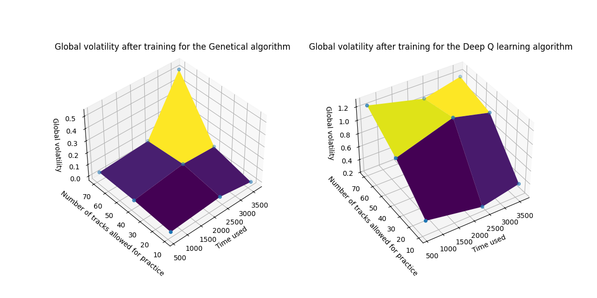
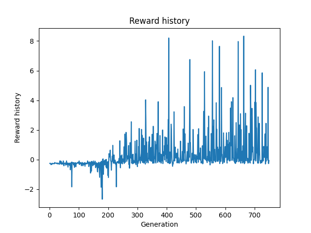
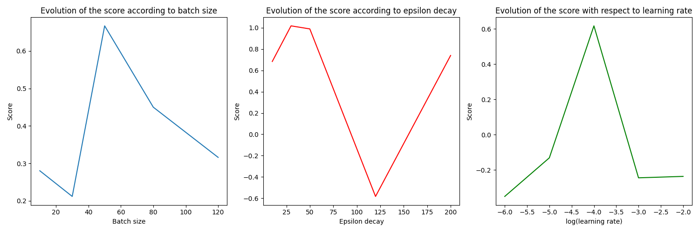
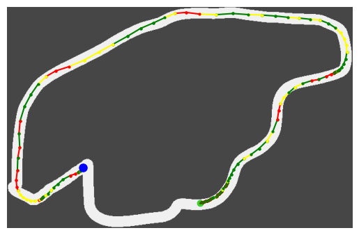
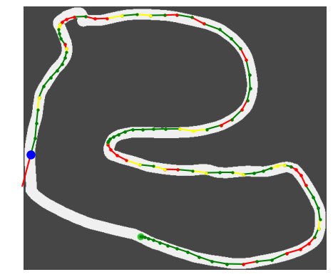

# Abstract

The project is divided into five parts:
 -  Creating a racing car environment to simulate a simple 2D racing car model.
 -  Implementing Deep Q-Learning and Genetic Algorithms to optimize the behavior of a car on every possible tracks, enabling it to follow the best possible trajectories.
 -  Evaluating the performance of Deep Q-Learning and Genetic Algorithms and comparing their results.
 -  Assessing the performance of Deep Q-Learning with respect to different hyper-parameters.
 -  Evaluating the performance of the best car behavior achieved by both algorithms.

# Introduction

We focus on solving the problem of optimizing a car's trajectory using a Deep Q-Learning model. 
The goal is to assess the ability of this model to generalize its experience from a limited number of circuits to new ones. 
To achieve this, we consider the car's trajectory in a plane under a simplified physics model. 
The model's performance will be compared to that of a genetic algorithm. 
Then, we will examine the impact of the chosen hyper-parameters on the model's training performance. 
Finally, we will explore the model's limitations when trained on a large amount of data.

# Modeling
## Racing environment
### Tracks
A track is originally a .png file as shown by the first image of the next figure. Then, the image is converted to a matrix $T$ such that $T[0][0]$ is the bottom left corner.  Finally, we crop the image, compute the starting point, and determine the lines of the track (these will be explained in the reward section) to obtain the final result shown by left image of next figure. 
 

	
### Car's physics
The car's physics model is quite simple, it follows a 2D cartoon-like set of physical laws :

-  The car is characterized by two main properties: its speed $s \in [0, \text{MaxSpeed}]$ and its direction $\alpha \in [0, 360]$
-  The physical laws work as follows: at each time step, the car moves in the direction defined by $\alpha$, covering a distance equal to its speed.
-  If the current coordinates are $(x, y)$, its speed is $s$, and its direction is $\alpha$, then after one time step, the new coordinates of the car will be:
$$
(s \cdot \cos\left(\frac{\pi}{180}\alpha\right) + x,\; s \cdot \sin\left(\frac{\pi}{180}\alpha\right) + y)
$$

Moreover, at each time step, the car will take an action:

 -  It can accelerate, this will increase the car's speed by a constant.
 -  It can brake, this will decrease the car's speed by a constant. Note that the car cannot have a negative speed, it means that it cannot go backward.
 -  It can turn, i.e. add a constant $\in \llbracket-K,K\rrbracket$ to its rotation. $K$ is a constant that is the maximum angle the car can turn per time step.
\tab \\
The car needs to interact with the track, therefore we need to decide what is the state of a car, i.e, what the car knows about the environment. 
We could model a state by the matrix of the track and the information of the car but this would lead to a state of large dimension because a track can have size $900\times600$ pixels. Moreover, it will be hard to train from those states because there is a great diversity of possible tracks. 
To reduce the dimension of the problem, we decided to represent a state as a real car racer would see it. Then, the state of a car is an array $V$ of size $8$ : 
 -  $V_0$ is the current speed of the car
 -  $\forall i\in\{1,...,7\}$, $V_i$ is the distance of the car to the closest wall in the direction $\alpha + A_{i-1}$ where $\alpha$ is the current direction of the car and $A=[60, 40, 20, 0, -20, -40, -60]$
Then, a typical state is represented by the next figure.

		
### Technical aspects of the environment
To manipulate our environment, we use the python package gymnasium which provides conventions for Markov decision process environments (i.e. environment in which at each time step you have to take an action and receive a reward). 
The environment must have some essential methods: `reset()` that resets the environment in order to begin a new simulation, `render()` that renders the current state of our environment, 
and the `step()` function which moves the car to the next position and return the new state, a reward and a boolean representing if the car has crashed or not.
Finally, the environment has a variable time which measures how much time is discretized.
		
### Rewards
Machine Learning algorithms usually try to optimize an objective function that reflects 
the problem that the real application wants to solve. In our case the objective function 
will depend on the rewards that the agent will observe when taking actions. Typically, the reward 
will be low if the car crashes and high if the car is fast.
The reward is computed by the method `step()` of our environment. 
Clearly, the quality of the training highly depends on quality of the reward function.
We tried lot of reward functions, some that we invented, other that we saw in other projects and ended up using the following one:

To discourage bad choices we do:

 -  If the car crashes, we stop the simulation and return a reward of $-500$.
 -  If the car is not moving, (i.e. has a speed of $0$) we return a reward of $-10$.
For the positive reward, we have automatically computed some track lines thanks to an algorithms we created (represented by the second image of first figure. 
If the car crosses next line, it receives a reward of $(+10\times$ the number of lines it has crossed with one action). 
If the car crosses a line in the wrong order, it means that it has gone backward, therefore, we punished the car with a reward of $-200$ and we stop the computation.

On top of that, at each time step, we add to the current reward the speed of the car divided by a constant to encourage the car to go fast. Finally, we subtrack the reward by $1$ to encourage the car to cross has many lines has possible with the least amout of time steps.

### An example of a car on a track
The next figure shows an example of a car on a track. We plotted the trajectory of the car : the green color means that the car is accelerate, red color means that the car is braking, and yellow represents all the other actions.

The total reward of a car behavior is the sum of all reward of a simulation with a car behavior. For example, the reward of the car behavior of the figure previous figure is

$$\underset{r \in R}{\sum} r= -343$$

## Deep Q-learning
Deep Q-Learning is a reinforcement learning algorithm that combines Q-Learning with Deep Learning to solve complex decision-making problems. It allows an agent to learn how to act optimally in environments with large state spaces by approximating a function, known as the Q-function, which evaluates the quality of an action taken in a given state.
    
### Q-function
The Q-function, $Q(s, a)$, represents the expected cumulative reward an agent will receive after taking action $a$ in state $s$, and then following the optimal policy. The Q-function satisfies the Bellman equation:
$$Q(s, a) = r + \gamma \max_{a'} Q(s', a'),$$
Where:

 -  $r$ is the immediate reward received after taking action $a$ in state $s$.
 -  $s'$ is the next state reached.
 -  $a'$ is the next action.
 -  $\gamma \in [0, 1]$ is the discount factor, which balances immediate and future rewards.
    
### Key Techniques

-  Replay Buffer: A memory that stores past experiences $(s, a, r, s')$. Randomly sampling experiences from the buffer during training reduces correlations between consecutive samples, improving learning stability.
-  Exploration-Exploitation Balance: The agent uses an $\varepsilon$-greedy policy to choose actions, where it explores randomly with probability $\varepsilon$ and exploits the best-known action otherwise.
    
### High-Level Workflow

 -  Observe the current state $s$.
 -  Choose an action $a$ using an $\varepsilon$-greedy policy.
 -  Execute the action, observe the reward $r$ and next state $s'$.
 -  Store the experience $(s, a, r, s')$ in the replay buffer.
 -  Sample a mini-batch of experiences from the buffer to train the Q-network.
    

	
## Genetic algorithms
### What are genetic algorithms?
Genetic algorithms (GA) are probabilistic algorithms based on natural selection. Therefore, GA takes some populations which are sets of solutions (here a solution is a car's behavior), selects the best solutions thanks to the reward function. Then, it changes the population by adding new random solutions, adding some mutations which are some small variations of a behavior, adding some cross-over which are the equivalent of natural reproduction. We can either repeat this process a fixed number of generations or for a fixed amount of time.
		
		
### NEAT
Basic genetic algorithms are not efficient enough to compute an optimized policy in a reasonable time. 
Therefore, we will use the NEAT python package. 
This is an optimized generalized genetic algorithm which represents solutions as dynamic neural network. 
By dynamic we mean that the algorithm can add or delete some of the nodes of the neural network. 
The principle of GA stay the same but we have a lot more hyper-parameters.
	
	
# Simulation
Once we completed the modeling of the environment, the Deep Q-Learning algorithm and the Genetic algorithm, we trained several models and evaluated their performances. We compared our two algorithms using several metrics. For this purpose, we chose the following metric: the average reward after the training, we call it the score of a training. We measured this value across different training durations and varying the number of tracks used to train the models. To ensure robustness and evaluate potential over-fitting, we tested the models on tracks that were not included in the training set. The goal of the car is to complete laps as quickly as possible, and the average reward reflects their performance under these conditions. We will evaluate the performances of the Deep Q-Learning algorithm in three steps: 
 -  First, we will compare genetic algorithm to Deep Q-Learning depending of the training time and the number of tracks used to train the car. We trained our algorithms during $10$ to $60$ minutes and with $10$ to $67$ tracks (which represents $80\%$ of the total number of tracks created).
 -  Then, we will compare the result of Deep Q-Learning depending of some hyper-parameters. The goal here is to be able to find the hyper-parameters that fit the most with our problem, and this evaluation can only be made by running the algorithms with different parameters.
 -  Finally, we will evaluate the performance of the best model we found using Deep Q-Learning.

# Experimentation

All the computations presented in this section were performed on the Grid5000 (https://www.grid5000.fr) infrastructure, which allowed us to ensure the reproducibility of the results and guarantee a consistent comparison of the executions. 
They were carried out on stable machines with equivalent performance.

## Comparison between Deep Q-Learning and Genetic Algorithm

Firstly, our goal was to compare the different models we tried to use to train the car. To achieve this, we chose to allocate a certain amount of time and a specific number of tracks for the different models. The models were allowed to train for this amount of time on Grid5000.

We chose to evaluate the models on these metrics because we believe they are the most important in the training of such AI. Indeed, these metrics provide users with an idea of how powerful the models can be.

As mentioned before, we chose to evaluate the average reward on tracks on which the car had not trained. We believe this is the most relevant way to evaluate the training because it allows us to determine if overfitting occurred or not, and it reflects how well the car performs on the tracks. Since the training can take a long time to yield satisfying results, we chose to focus on the following durations: $\{10;40;60\}$ (minutes) and the following number of tracks for training: $\{10;40;67\}$ (tracks). We evaluated these trainings on $20$ tracks that were not included in the training set. The two models were run with specific hyperparameters. The results are shown in next figure.

We can notice that the Deep-Q algorithm outperforms the Genetic algorithm in every test. Also, we notice that sometimes the use of more time or more tracks can lower the performance or our Deep Q-Learning algorithm. This is surely due to over-fitting.

To compare the models, we can also look at the global volatility of the rewards, this represents the standard deviation of the cumultative rewards observed during the training. In order for the algorithm to perform efficiently, we want it to have low standard deviation. The result are shown in next figure.

Finally, we can look at the evolution of the reward for the Deep Q-Learning for $60$ minutes of training on $67$ tracks to estimate when is over-fitting happening for this training. We can see that the reward does start decreasing after $650$ generations, this can be a sign of over-fitting.

        
        
## Influence of Hyper-parameters on Deep Q-Learning
Focusing on the Deep Q algorithm, we can wonder what are the best hyper-parameters. We focused on $3$ hyper-parameters that we perceived as more important in our model:

 -  Batch size : the number of samples used to optimize the model's parameters for each optimization step. 
 -  Lr (learning rate) : the velocity at which the neural network updates the weights. 
 -  Epsilon Decay : the probability that the model will try to explore new ways. 
We get the following results. These graphs allow us to have an idea on how efficient each hyper-parameter tested is. For example, for the batch size, we want to have a batch size of $60$ in order to be efficient.

        
        
  
## Best Car: performances of a model trained for few hours 
We can now analyze the performance of the best car, which corresponds to the model with the highest score among the trained models. Firstly, as observed in part one, training for an extended period on a limited number of tracks can lead to overfitting. This phenomenon was also evident when we trained a model for six hours under the same conditions as the others. This model performs significantly worse than the best car.  

The next figure illustrates the evolution of the car on tracks it has never encountered before. The model appears to have generalized its knowledge well to new circuits. Moreover, with a global volatility of approximately $1$ and high rewards, the training seems relatively stable with respect to the average reward. We attribute this stability to a low learning rate of $10^{-4}$.  

Finally, using the following hyperparameters: 
 - [Learning rate] $10^{-4}$  
 - [Batch size] $40$  
 - [Epsilon decay] $30$  

the model demonstrates that the best hyperparameters identified in the previous section work well together. This raises the question of whether this approach to hyperparameter tuning can be generalized to other reinforcement learning algorithms.  

# Conclusion

The goal of the project was to evaluate the performance of Deep Q-Learning on the problem of optimizing car trajectories. To carry out this project, we created an environment to model the evolution of a car on different tracks. Finding a relevant reward function for the algorithm was a key part of the work.
We then measured the performance of Deep Q-Learning using several metrics. In particular, we observed that Deep Q-Learning performs significantly better than the Genetic Algorithm in our context. Evaluating the algorithm allowed us to determine the best hyperparameters for our models, as well as the optimal training time and number of tracks. Our goal was to compare the performance of the algorithms, and we believe that using the score and global volatility were relevant metrics.

We observed that, in our case, merging several (locally) optimal parameters led to the best global score. This raises the question of whether this observation holds for other reinforcement learning algorithms and whether it scales to a larger set of hyperparameters.

We could have explored many more hyperparameters, such as the size of the replay buffer and the depth or size of the neural network, to perform a deeper analysis of the algorithm. Moreover, we could have compared Deep Q-Learning with other state-of-the-art reinforcement learning algorithms for a fairer comparison. Finally, it is important to recall that the physics of the car used in this project is a simplified model of reality. To evaluate the performance of Deep Q-Learning for real car driving, the model would need to be significantly more complex.